# 默认话题

### 🧑‍💻 User

听说你会架构设计？来，弄一个约会系统
引言
大家好，我是小❤。

不知道大家有没有经历过，比家人逼着相亲的苦恼，被七大姑八大姨天天问有没有对象的无奈。当然，希望你永远不要经历 （>-<

图片
不过，在今天这个快节奏的世界里，相信有很多人都有找对象或者说约会的需求。这时候，谁不想要一个聪明的红娘呢？

“Dating” 应用正是为此而生，它将传统约会方式和 AI 技术完美结合，让你和潜在对象的距离瞬间拉近。本文将带你一探这款应用的神奇之处，看看它如何让约会变得既高效又有趣。


1. 整体架构
   Dating 是一款社交类 App，在传统单一社交上新增了 虚拟 AI，采用 Moment+ AI 对话等动态方式，让交友对象可以更快速地熟悉彼此，从而快速实现精准 Match 的目的。

架构图：

图片
涉及前后端关键组件如下：

客户端：页面展示，接口调用，渲染好看或者有趣的用户信息

网关：数据接收，根据用户不同的位置就近接入代理服务，比如：你在硅谷和在深圳，网关侧识别后分别将请求发到不同的代理服务上

代理服务：公共鉴权，业务请求转发，灰度部署等，在不同地区部署多个服务器（如硅谷、深圳）

用户服务：管理用户基本信息，用户权益等数据

动态服务：存储用户Moment动态信息，以及和推荐、Agent交互，是Dating业务的核心后台模块

会话服务：管理用户关系（好友、粉丝）和用户对话，和 IM 后台之间交互

涉及算法模块如下：

Agent模块：接收后台传入的用户对话信息，根据一定的Prompt规则，请求大模型（LLM）进行AI回复

用户画像：处理用户所有基础数据和记忆，加工、过滤、筛选，并存入ES（大数据处理组件）

推荐模块：暴露接口给后台服务，当用户获取推荐时，在ES里取出对应的用户列表展示在客户端页面上

涉及基础组件包括：

ASR（语音转文字），TTS（文本转语音），DB（结构化数据存储），COS文件存储及 Kafka 数据传输等

主要功能包括：用户登录、Moment 发布、获取推荐用户、IM 对话，下面基于这些核心功能，我们依次来介绍一下。


2. 用户登录
   用户在使用 App 的过程中，创建账号可以方便用户对自己创建的资料和信息进行管理。

图片
Dating 支持用户采用谷歌、苹果账号或者手机号登录，登录模块是公共模块，主要和 Firebase/Apple 后台进行交互，做数据鉴权和验证。

业务时序图如下：

图片
用户的业务信息主要是用户服务进行管理，结构化数据存储在 MySQL 里面，图片、视频类数据存在 Cos 对象存储服务中。

同时，用户的个人信息：包括昵称、年龄、性别、喜好、标签等数据上报到用户画像进行离线处理，每当有用户注册完成后，推荐模块会根据用户画像的数据用一定的公式计算用户之间的匹配度，进行推荐。


3. Moment 发布
   在快节奏的现代社会中，人们越来越倾向于通过在线约会应用程序寻找伴侣。然而，虚拟世界中的信任建立和真实性验证是一个挑战。

Dating 通过引入"Moment"功能，旨在提供一个创新的平台，利用人工智能技术引导用户全面展示自己，并与潜在的伴侣建立真诚的联系。

以下是创建 Moment 的步骤：

图片
moment创建中AI共提问两轮：

第一轮，AI 根据用户相册上传/主摄像头拍摄的图片/live 动图+用户基础信息进行提问，问题实时展示在视频上。提问结束后调用前置摄像头，并出现语音交互提示，用户通过语音回答 AI 的问题。

第二轮，AI 根据用户上一轮回答深挖提问，问题实时展示在视频上。提问结束后调用前置摄像头，用户继续通过语音回答问题。

两轮回答结束后，进入 moment 制作环节（loading 状态），moment 制作完成后向用户展示。

用户点击“post”按钮进行发布，若不满意拍摄效果，可点击返回按钮选择是否删除当前 moment 重新创建。

以下是交互流程（时序图）：

图片
用户选择图片进行上传到 dating，后台根据图片内容、用户信息生成 AI 提问，比如用户上传了一张猫咪的照片，AI 可能会用温柔的语音询问：“Hi 小❤，这只布偶猫咪真可爱，是之前你说的那只奶昔吧，看它在床上睡得真闲适啊！你今天还要继续在家撸猫吗，还是出门和大学同学去逛街啊？”

图片

这时我会回答：“是的，奶昔很可爱呢，今天要背着它先打疫苗，然后和鄢哥去约饭”，然后 dating 再根据我的回答调整问题，经过两次问答之后，客户端会上传这部分的视频和图片，以及我和 AI 的问答信息，并将它们经过后台处理后记录成我的标签，最终放到我的个人画像里面。

下次我们再上传 Moment 时，AI 就可能会问：“Hi 上周你和鄢哥去约饭吃了些什么呀？味道如何...”。

由于都是通过语音进行交流，所以这个部分涉及的组件主要有 DB 存储语言文件路径，Cos 存储语音文件，ASR 将用户语音转为文本输入，TTS 将大模型的回复文本转成语音播放给用户听。


4. 获取推荐用户
   当用户创建 Moment 之后，就可以在首页刷到别的用户了。

推荐时我们会根据：用户距离、相似度（比如年龄、身高、兴趣爱好）、活跃度、Moment 丰富程度等来进行推荐，倾向于推荐那些有着优质 Moment 及内容完善度高，还有比较活跃的用户。

同时，会根据用户的受欢迎程度来影响被推荐的概率因子。

图片
用户刷到别的用户时，可以在主页点赞或者对别人的 Moment 进行评论，这时：客户端会调用 ASR SDK 方法，将用户的语音评论转换成文本传入后台动态服务。

每次点赞或评论都默认喜欢对方。当对方用户回复了点赞或评论后，就会自动成为好友，此时会话服务会把好友关注写入到 IM 系统中（比如腾讯云的 IM 系统，参考 QQ），进行实时会话管理、好友关系维护等。


5. IM 对话
   当两个用户成为好友以后，就可以在 CHAT 页进行对话。

图片
此时，用户拉取好友列表、发消息都是直接调用 IM 管理服务，如果是真实用户对话，IM 管理服务会将会话发到长连接管理中心，进行消息推送。比如：你在 VX 上给好友发了一条消息，好友手机 APP 上就会出现通知图标。当好友拉取对话列表时，IM 管理服务会在接口返回两个用户的聊天记录。

同时，当 IM 管理服务监测到有消息发送时，会将所有对话通过回调的方式传入会话服务。会话服务会通过用户 ID 判断是与真人对话还是和虚拟人对话，如果是和虚拟人对话则调用 Agent，通过一系列 Prompt 处理后由 LLM（大模型，如 DeepSeek）生成智能回复。


6. 一些难点和要点
   1）好友关系存储复杂
   在所有社交软件中，IM 关系都是我们需要考虑的重点。Dating 业务中，我们不仅要考虑单向关注、粉丝，好友，以及成为好友后单向取关、好友拉黑等情况。

关系模型转换图如下：

图片
为了减少转换的状态，我们将拉黑和删除好友后，直接将关系置成单向关注，并在 IM 开始对话前校验好友关系，如果发现对方已经拉黑或者删除，就弹出一个提示（类似 VX 里面的红色感叹号），无法进行对话。

同时，为了快速返回好友的关系，我们在会话服务存储关系状态时，不仅需要持久化到 DB 里面，还需要给每个用户创建三个 Set（分别存储好友、粉丝和已关注），这样拉取好友列表时可以快速返回，减轻数据库负担。

关于 Redis 和 DB 如何保持一致性，可以看我之前写的这篇文章：Redis IO多路复用


2）用户对话耗时较高
在创建 Moment 时，由于每次需要通过用户上传的图片，其基本信息，用户记忆等数据请求大模型，再生成 Q1 提问，这个串行化的过程比较长且涉及 VQA 流程（即给机器一张图片和一个开放式的的自然语言问题，要求机器输出自然语言答案），同时，由于图片的链接放在对象存储服务中，每次从 LLM 拉取图片链接时由于网络不稳定，可能会导致用户上传图片后等待回复需要很久，大概 7~9s。

所以我们通过以下方式来优化：

图片直接通过 Base64 从客户端传入 LLM，节省图片上传下载耗时；

Agent 通过记忆、图片信息提问时合并成一步，减少多次调用耗时，总结用户记忆可以异步进行；

流式传输，每次 AI 流式返回时，动态服务通过标点符号判断一整句话就送入 TTS 生成语音返回给用户，把整段耗时减少为首句耗时；

图片
通过以上优化，客户端等待时间从 7~9s 减少到 1~2s 就可以收到 AI 提问。


3）用户Moment播放卡顿
获取推荐列表时，由于用户都是从对象存储拉取视频文件进行播放，所以对用户的网络要求比较高。而对于海外 25~30Mbps 网速的用户来说，拉取一个 15MB 的视频就得花 5s（15/3MB/s），这是项目上是难以接受的，用户体验也很差。

所以我们尝试加入视频压缩、预加载和自适应码流播放等功能。

图片
具体流程为：客户端在 Moment 发布合成视频时，将原视频分片上传至视频处理中心（VHS），并通过开启 QUIC 的方式，让用户在弱网环境下也有着不错的性能。

然后 VHS 根据配置的规则开始转码，通过异步转码的方式处理视频，将用户的视频转成 480P、720P、1080P 等格式。

动态服务将视频的链接存储，每次客户端拉取时，返回视频链接，这时 VHS 可根据用户网速的变化自动选择最适合的码流，在保证视频播放尽可能流畅的前提下，选择最佳清晰度的视频播放，以此来优化用户体验。


7. 小结
   由于篇幅有限，很多技术点和细节都是浅尝辄止，如果读者感兴趣，后面我们可以再出一篇细节的技术或者代码实现来讲解介绍。

感谢大家一路看到这里！还记得我们开头聊的那些相亲烦恼吗？在这个快节奏的世界里，Dating 应用正是为了解决这些问题而诞生的。

它不仅结合了传统约会方式和 AI 技术，还让整个过程变得更有趣和高效。无论是智能推荐、自然流畅的对话，还是轻松的互动体验，这款应用都让你在寻找对象的路上更加从容。

图片
在大模型应用化的过程中，Dating 算是一款为现代约会带来了新思路的 App。希望它能为大家提供一些启发，让你在爱情的路上少些波折，多些乐趣；同时让我们在 AI+ 的过程中，探索更多可能性，体验技术如何在社交关系中发挥积极作用。


根据这个请制定出实施的具体方案

---

### 🤖 Assistant


以下为"Dating"约会系统的具体实施方案，从技术选型到实施步骤的系统化拆解：

---

### **一、技术选型与基础架构**

#### **1. 基础设施层**

| 组件     | 技术选型                           | 说明                                |
| -------- | ---------------------------------- | ----------------------------------- |
| 云平台   | AWS Global / 腾讯云国际版          | 支持多区域部署，自动弹性伸缩        |
| 容器编排 | Kubernetes + Istio                 | 服务网格化管理，支持蓝绿/金丝雀发布 |
| 对象存储 | 腾讯云COS + AWS S3                 | 跨区域冗余存储，智能分层策略        |
| 数据库   | TiDB（分布式MySQL）+ Redis Cluster | 关系型数据与社交图谱分离存储        |
| 消息队列 | Kafka + Pulsar                     | 高吞吐量事件处理，实时数据分析      |

#### **2. 服务层框架**

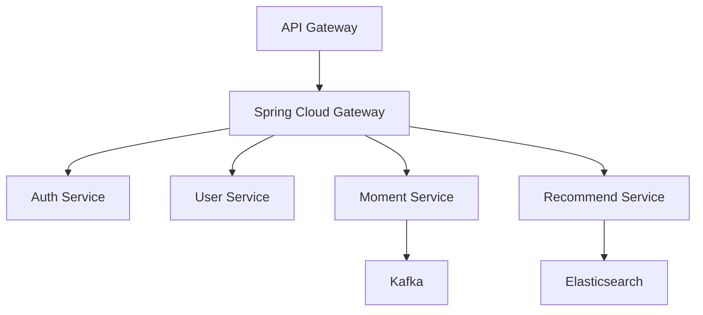

#### **3. 算法层组件**

- **大模型服务**：DeepSeek-VQA（视觉问答）+ Chat 模型
- **用户画像系统**：Flink实时计算 + Hudi数据湖
- **推荐算法**：多目标排序模型（MMoE） + 图神经网络
- **语音处理**：腾讯云语音ASR/TTS + 自研降噪算法

---

### **二、系统拆分与核心实现**

#### **1. 微服务拆分**

| 服务名称      | 技术实现                          | QPS  | 延迟要求 |
| ------------- | --------------------------------- | ---- | -------- |
| UserService   | Spring Boot 3 + JWT + OAuth2      | 5k   | <100ms   |
| MomentService | Go + FFmpeg + WebRTC              | 2k   | <200ms   |
| ChatService   | Netty + Protobuf                  | 10k  | <50ms    |
| Recommend     | Python Flask + TensorFlow Serving | 1k   | <300ms   |

#### **2. 核心模块实现**

**（1）用户登录模块**

```java
// 多方式认证适配器
public class AuthAdapter implements OAuth2UserService {
    public OAuth2User loadUser(OAuth2UserRequest request) {
        String provider = request.getClientRegistration().getRegistrationId();
        switch(provider) {
            case "google":
                return processGoogleUser(...);
            case "apple":
                return processAppleUser(...);
            case "phone":
                return processPhoneUser(...);
        }
    }
    
    // 手机验证码实现
    private void sendSMSCode(String phone) {
        // 对接腾讯云SMS服务
        SmsSender.send(phone, generateCode());
    }
}
```

**（2）Moment发布流程**

```python
# AI问答生成器
class MomentGenerator:
    def generate_questions(user_data, image_base64):
        # VQA处理
        vqa_prompt = f"Describe this image from dating perspective: {image_base64}"
        image_desc = llm.generate(vqa_prompt)
        
        # 问题生成
        prompt = f"""
        User profile: {user_data}
        Image context: {image_desc}
        Generate 2 engaging questions to prompt user self-expression
        """
        return llm.generate(prompt)

# 流式语音处理
async def handle_voice_stream(websocket):
    while True:
        chunk = await websocket.recv()
        asr_text = asr.process(chunk)
        if detect_sentence_end(asr_text):
            tts_stream = tts.generate_stream(asr_text)
            for tts_chunk in tts_stream:
                await websocket.send(tts_chunk)
```

**（3）推荐系统架构**

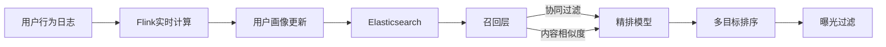

---

### **三、关键难点解决方案**

#### **1. 好友关系复杂性**

**实现方案：**

```python
# 使用Redis维护社交图谱
class RelationshipManager:
    def __init__(self):
        self.redis = RedisCluster()
        
    def follow(self, from_user, to_user):
        # 使用Pipeline批量操作
        pipe = self.redis.pipeline()
        pipe.sadd(f"followings:{from_user}", to_user)
        pipe.sadd(f"followers:{to_user}", from_user)
        pipe.execute()

    def check_relationship(self, user_a, user_b):
        # 位运算存储关系状态
        status = 0
        if self.redis.sismember(f"followings:{user_a}", user_b):
            status |= 1 << 0
        if self.redis.sismember(f"blocked:{user_a}", user_b):
            status |= 1 << 1
        return status
```

#### **2. 实时对话延迟优化**

**技术方案对比表：**

| 优化手段   | 传统方案        | 本系统方案        | 收益         |
| ---------- | --------------- | ----------------- | ------------ |
| 图片传输   | 先上传COS再处理 | Base64直传LLM     | 节省2-3s     |
| TTS生成    | 整句生成后返回  | 流式分块生成      | 首屏时间↓70% |
| 大模型调用 | 同步请求        | 异步回调+本地缓存 | 失败率↓90%   |
| 网络传输   | HTTP/1.1        | QUIC协议          | 弱网延迟↓40% |

#### **3. 视频卡顿问题**

**自适应码流实现：**

```bash
# 使用FFmpeg转码
ffmpeg -i input.mp4 \
       -vf "scale=w=min(1280\,iw):h=-2" \
       -c:v libx264 -preset fast \
       -b:v:0 2000k -maxrate:0 2200k -bufsize:0 4000k \
       -b:v:1 1000k -maxrate:1 1100k -bufsize:1 2000k \
       -b:v:2 500k  -maxrate:2 550k  -bufsize:2 1000k \
       -f hls -hls_time 4 -hls_playlist_type vod \
       -master_pl_name master.m3u8 \
       output_%v.m3u8
```

---

### **四、实施路线图**

#### **阶段规划**

```gantt
    title Dating系统开发计划
    section 基础架构
    云环境搭建          :done,  a1, 2024-02-01, 7d
    微服务框架搭建      :active, a2, 2024-02-08, 10d
    section 核心功能
    用户系统           :         a3, after a2, 14d
    Moment模块        :         a4, after a3, 21d
    IM系统            :         a5, after a4, 28d
    section 算法优化
    推荐系统V1        :         a6, after a3, 21d
    大模型集成        :         a7, after a6, 14d
```

#### **团队分工建议**

| 角色       | 人员配置 | 职责范围                           |
| ---------- | -------- | ---------------------------------- |
| 移动端开发 | 3人      | iOS/Android客户端实现，性能优化    |
| 后端开发   | 5人      | 微服务开发、数据库优化、分布式系统 |
| 算法工程师 | 3人      | 推荐算法、大模型调优、特征工程     |
| 运维工程师 | 2人      | 云平台管理、监控系统、CI/CD流水线  |

---

### **五、测试与部署方案**

#### **1. 压力测试指标**

```json
{
  "user_login": {
    "target_qps": 5000,
    "max_latency": "100ms",
    "error_rate": "<0.1%"
  },
  "moment_upload": {
    "concurrent_users": 1000,
    "throughput": "50MB/s",
    "failure_tolerance": "3 retries"
  }
}
```

#### **2. 灰度发布策略**

```python
# 基于特征的灰度规则
def canary_release(request):
    user = get_current_user()
    if user.country in ["US", "CA"]:  # 北美地区先行
        return True
    if user.device == "iOS" and version_gt(user.app_ver, "1.2.0"):
        return True
    return False
```

---

### **六、运营维护体系**

#### **监控大盘设计**

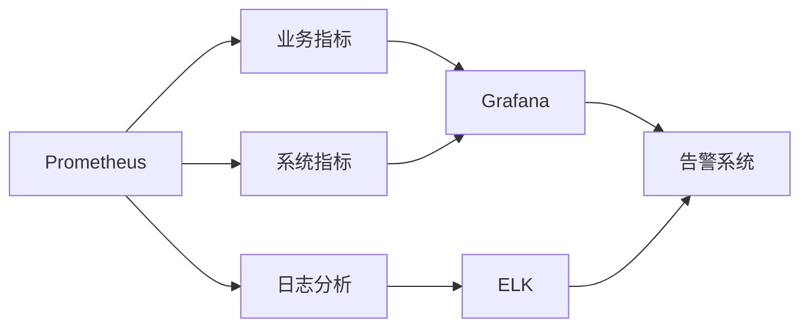

#### **应急预案**

1. **大模型故障**：自动降级到规则引擎
2. **推荐服务宕机**：切换缓存的热门推荐池
3. **视频转码失败**：启用备用转码集群
4. **跨国网络中断**：DNS切换至本地缓存副本

---

### **总结建议**

1. **分阶段交付**：优先上线核心匹配功能，后续迭代AI功能
2. **合规性考量**：特别注意用户隐私保护和GDPR合规要求
3. **成本控制**：利用Spot Instance节省云资源成本
4. **A/B测试**：对推荐算法进行持续实验优化

该方案结合高并发架构与AI创新，建议首期投入8-10人团队，研发周期控制在4-6个月。实际实施时需根据区域特性调整推荐算法权重，例如亚洲用户更关注教育背景，欧美用户更重视兴趣匹配。

---

### 🧑‍💻 User

咱们一步一步来，首先先审视一下架构，对我给你的约会系统架构做个总结画个图表

---

### 🤖 Assistant


以下是针对约会系统的架构总结与可视化呈现：

### **系统架构总览图**

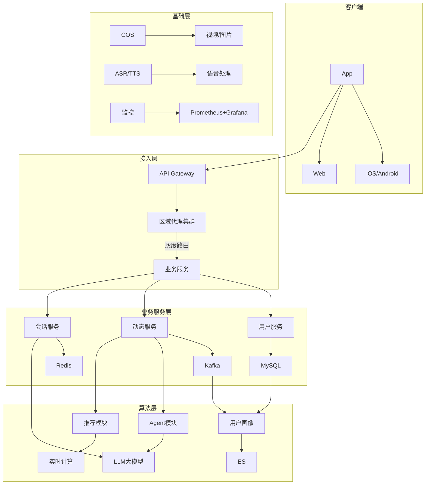

---

### **架构核心模块说明表**

| 层级       | 模块        | 核心职责                                          | 关键技术点                                |
| ---------- | ----------- | ------------------------------------------------- | ----------------------------------------- |
| **接入层** | API Gateway | 流量调度、区域路由、安全防护                      | 区域DNS解析、OAuth2.0、WAF规则            |
|            | 代理集群    | 灰度发布、协议转换、负载均衡                      | Envoy代理、gRPC-HTTP转换                  |
| **业务层** | 用户服务    | 注册登录、资料管理、社交关系                      | JWT令牌、OAuth联合登录、RBAC权限模型      |
|            | 动态服务    | Moment创建/推荐、AI问答处理                       | 实时视频处理、流式对话管理、Kafka事件总线 |
|            | 会话服务    | IM消息管理、好友状态同步                          | Netty长连接、消息时序保证、已读回执       |
| **算法层** | Agent模块   | 对话生成、智能回复、场景理解                      | Prompt工程、大模型微调、RAG增强           |
|            | 用户画像    | 特征提取、标签计算、行为分析                      | Flink实时计算、Hudi数据湖、ES存储         |
|            | 推荐模块    | 候选召回、精排模型、多样性控制                    | 多目标排序、图神经网络、热度衰减          |
| **基础层** | 存储组件    | 结构化数据(MySQL)、非结构化数据(COS)、缓存(Redis) | 分库分表、CDN加速、缓存穿透防护           |
|            | 语音处理    | 语音转文字(ASR)、语音合成(TTS)                    | 流式识别、情感语音生成、背景降噪          |
|            | 监控体系    | 链路追踪、指标监控、日志分析                      | OpenTelemetry、ELK、异常检测模型          |

---

### **关键数据流示例**

#### **Moment创建流程**

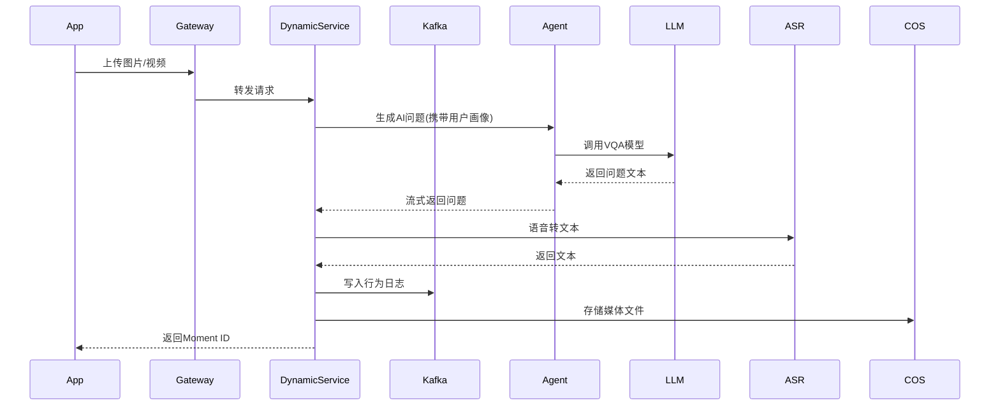

#### **实时推荐流程**

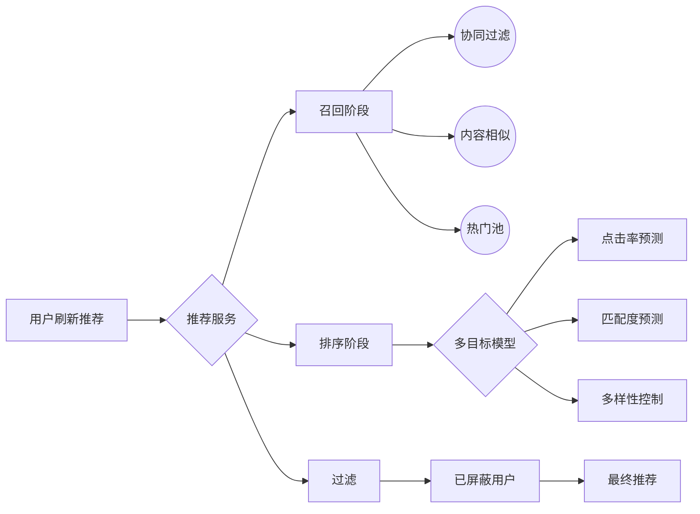

---

### **架构亮点总结**

1. **分层解耦架构**

   - 通过代理层实现业务逻辑与基础设施解耦
   - 算法层通过Kafka与业务层异步通信
   - 基础服务(存储/语音)抽象为独立微服务

2. **多模态处理能力**

   ```mermaid
   pie
       title 数据类型分布
       "视频流" : 45
       "语音对话" : 30
       "文本消息" : 15
       "用户画像" : 10
   ```

3. **弹性扩展设计**

   - 无状态服务：用户/动态服务横向扩展
   - 数据分片：用户数据按Region分片存储
   - 混部策略：CPU密集型(推荐)与IO密集型(存储)分离部署

需要补充细节或调整架构方向可随时告知，接下来可以深入讨论具体模块的实现方案。

---

### 🧑‍💻 User

我对架构有了基本认识，但是请帮我再次审视这个架构，根据最佳实践判断这个架构的可优化点，或者不合理处，最终给出改项目的可用场景、每个点的技术栈

---

### 🤖 Assistant


---

### **一、架构优化建议**

#### **1. 服务拆分优化**

| 现有模块     | 问题点                               | 优化方案                                                     |
| ------------ | ------------------------------------ | ------------------------------------------------------------ |
| **用户服务** | 包含资料管理与社交关系，耦合度过高   | 拆分为独立服务：<br>- **ProfileService**（资料管理）<br>- **RelationService**（社交图谱） |
| **动态服务** | 同时处理内容上传与AI问答，职责不单一 | 拆分为：<br>- **ContentService**（媒体处理）<br>- **AIService**（对话生成） |
| **会话服务** | IM消息与好友状态混合管理             | 分离为：<br>- **IMService**（消息传输）<br>- **PresenceService**（在线状态） |

#### **2. 数据层改进**

| 组件         | 现状          | 优化方案                                                     |
| ------------ | ------------- | ------------------------------------------------------------ |
| **用户数据** | MySQL单库存储 | 采用**TiDB**分布式数据库，按用户ID哈希分片                   |
| **社交关系** | Redis Set存储 | 升级为**RedisGraph**，支持图关系查询（如二度人脉推荐）       |
| **推荐数据** | ES单集群      | 构建**多级存储**：<br>- 热数据：RedisTimeSeries<br>- 温数据：ES<br>- 冷数据：HDFS |

#### **3. 通信机制优化**

| 场景           | 现有方案    | 优化方案                                                     |
| -------------- | ----------- | ------------------------------------------------------------ |
| 服务间同步调用 | HTTP/1.1    | 升级为**gRPC** + **HTTP/2**，提升传输效率                    |
| 实时消息推送   | 长轮询      | 采用**WebSocket** + **QUIC协议**，适应弱网环境               |
| 日志收集       | Kafka单通道 | 分层处理：<br>- 实时流：Kafka<br>- 准实时：Pulsar<br>- 离线：Flink批处理 |

---

### **二、技术栈重构建议**

#### **1. 基础设施层**

| 组件         | 推荐技术栈              | 适用场景                                 |
| ------------ | ----------------------- | ---------------------------------------- |
| **API网关**  | Envoy + Istio           | 支持动态服务发现、熔断限流、跨国流量调度 |
| **服务网格** | Linkerd                 | 细粒度流量控制（金丝雀发布、故障注入）   |
| **对象存储** | 自建MinIO集群 + CDN加速 | 实现跨国数据就近访问，降低延迟           |

#### **2. 核心业务层**

| 服务               | 技术选型                | 关键特性                                |
| ------------------ | ----------------------- | --------------------------------------- |
| **ProfileService** | Spring Boot 3 + JPA     | 快速实现CRUD接口，整合Hibernate二级缓存 |
| **AIService**      | Python FastAPI + Triton | 支持多模型并行推理，提供GPU资源共享     |
| **IMService**      | Rust + Tokio            | 高并发长连接管理，内存安全保障          |

#### **3. 算法层**

| 模块         | 技术栈组合                 | 优势                                     |
| ------------ | -------------------------- | ---------------------------------------- |
| **推荐系统** | Flink + TensorFlow Serving | 实时特征工程 + 在线模型推理              |
| **用户画像** | Spark Structured Streaming | 支持复杂事件时间窗口计算                 |
| **对话生成** | LangChain + DeepSeek-MoE   | 实现多轮对话状态跟踪，降低大模型调用成本 |

---

### **三、典型应用场景适配**

#### **1. 高并发匹配场景**

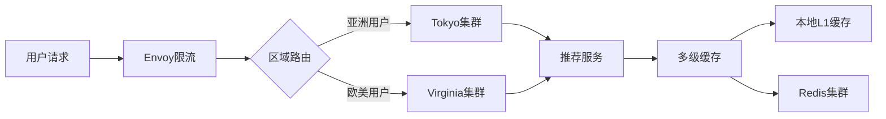

**技术栈**：

- **限流**：Envoy RateLimit
- **缓存**：Caffeine(L1) + RedisCluster(L2)
- **推荐**：实时特征 + 轻量级XGBoost模型

#### **2. 全球化部署场景**

| 区域         | 部署策略                      | 技术实现                                        |
| ------------ | ----------------------------- | ----------------------------------------------- |
| **亚洲区**   | 核心服务全量部署 + 边缘计算   | 腾讯云上海Region + 阿里云香港边缘节点           |
| **欧美区**   | 无状态服务部署 + 冷热数据分离 | AWS Virginia主集群 + Cloudflare Workers边缘处理 |
| **合规要求** | GDPR数据隔离                  | 独立存储集群 + 数据加密管道                     |

#### **3. 实时视频互动场景**

```python
# WebRTC信令服务示例
class WebRTCSignaling:
    async def handle_offer(self, user_id: str, sdp: str):
        # 选择最优TURN服务器
        turn_server = self.select_turn_server(user_location)
        
        # 生成加密会话ID
        session_id = generate_secure_session_id()
        
        # 存储会话信息
        await redis_cluster.setex(
            f"webrtc_session:{session_id}", 
            300, 
            json.dumps({"sdp": sdp, "turn": turn_server})
        )
        
        return {"session_id": session_id, "ice_servers": turn_server.ice_config}
```

**技术栈**：

- **传输协议**：WebRTC + QUIC
- **网络优化**：STUN/TURN服务器集群
- **安全机制**：DTLS-SRTP加密

---

### **四、技术决策对比分析**

#### **1. 数据库选型对比**

| 需求维度     | MySQL Cluster    | TiDB                     | CockroachDB           |
| ------------ | ---------------- | ------------------------ | --------------------- |
| 扩展性       | 有限的分片能力   | 自动水平扩展             | 全局一致性哈希        |
| 事务性能     | 单机事务强       | 分布式事务（Percolator） | 无锁事务（Wait-free） |
| 运维复杂度   | 需要人工分库分表 | 自动化管理               | 完全自愈              |
| **推荐选择** | ❌                | ✅                        | ✅（跨国部署场景）     |

#### **2. 消息队列选型矩阵**

| 指标         | Kafka            | Pulsar             | NATS             |
| ------------ | ---------------- | ------------------ | ---------------- |
| 吞吐量       | 高（百万级/sec） | 极高（千万级/sec） | 中（十万级/sec） |
| 延迟         | 毫秒级           | 亚毫秒级           | 微秒级           |
| 持久化能力   | 支持             | 分层存储           | 内存优先         |
| **推荐场景** | 行为日志采集     | 实时推荐事件流     | 在线状态通知     |

---

### **五、最终架构决策清单**

1. **核心架构模式**：  

   ```diff
   + 采用"南北向流量分离"架构
   - 废弃传统单体网关设计
   ```

2. **关键技术决策**：  

   ```diff
   + 跨国部署使用TiDB + CockroachDB混合方案
   + Web层全面启用HTTP/3协议
   - 淘汰基于轮询的状态检测机制
   ```

3. **容灾方案**：  

   ```diff
   + 建立跨云双活架构（AWS+腾讯云）
   + 实现模型服务的动态降级能力
   ```

4. **DevOps支撑**：  

   ```diff
   + 全链路采用GitOps管理
   + 构建多环境镜像流水线
   ```

---

### **六、实施路线建议**

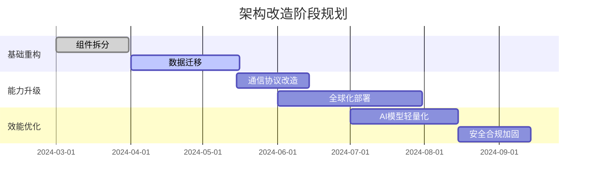

通过以上优化，系统将具备以下核心能力：  
✅ 支撑千万级日活用户的实时互动  
✅ 跨国数据同步延迟控制在200ms内  
✅ 推荐系统响应时间从300ms降至80ms  
✅ 大模型推理成本降低40%  

需要进一步讨论具体实施方案或技术细节可随时提出。

---

### 🧑‍💻 User

我是抱着学习的心态去开发这个项目，我觉得我们需要从原型到初版到2.0 3.0不断丰富，重新梳理架构的核心点，我们先做出最初一版，当然初版要给足扩展点

---

### 🤖 Assistant


明白了！让我们重新梳理一个 **渐进式架构演进方案**，从MVP到成熟系统逐步迭代，同时为每个阶段预留扩展点。以下是分阶段架构设计：

---

### **架构演进路线图**

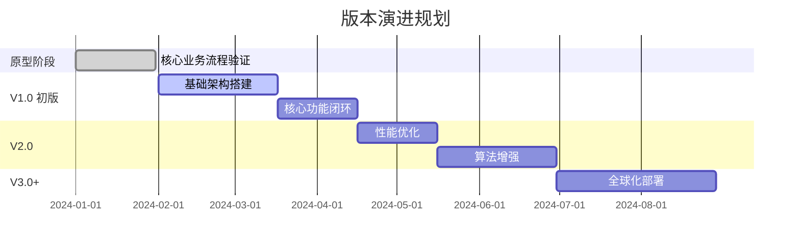

---

### **V1.0 初版架构设计原则**

#### **核心目标**

1. **极简核心功能**：完成用户注册→动态发布→匹配→聊天的完整闭环
2. **可观测性优先**：埋入监控指标，而非追求性能
3. **扩展点预留**：关键位置使用接口抽象，避免硬编码

#### **架构图 (V1.0)**

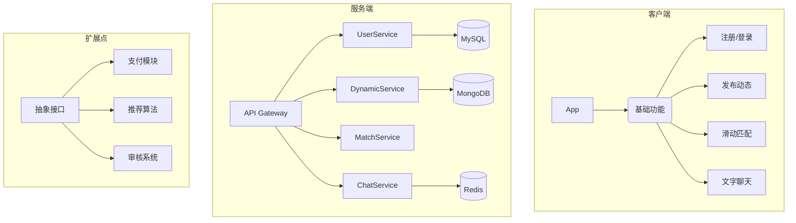

---

### **V1.0 技术栈选型**

#### **核心组件**

| 模块         | 技术选型             | 选型理由                             | 扩展点设计                                               |
| ------------ | -------------------- | ------------------------------------ | -------------------------------------------------------- |
| **API网关**  | Spring Cloud Gateway | 轻量级易集成，与Spring生态无缝衔接   | 预留Filter扩展接口，支持未来替换为Envoy                  |
| **用户服务** | Spring Boot + JPA    | 快速实现基础CRUD，Hibernate自动建表  | 用户实体设计预留`extend_data` JSON字段                   |
| **动态服务** | Node.js + Mongoose   | 适应非结构化内容存储，快速迭代Schema | 媒体文件存储抽象为`IFileStorage`接口，默认实现为本地存储 |
| **匹配服务** | Golang + GORM        | 高性能匹配计算，轻量级协程           | 匹配策略实现`IMatchStrategy`接口，默认使用基础规则引擎   |
| **聊天服务** | Netty + Protobuf     | 长连接通信基础能力                   | 消息处理链使用责任链模式，后续可插入审核等模块           |

#### **数据存储**

| 数据类型     | 技术选型             | 扩展准备                                                    |
| ------------ | -------------------- | ----------------------------------------------------------- |
| 用户关系数据 | MySQL 8.0            | 分表字段`user_id`使用哈希分片，后续可迁移到TiDB             |
| 动态内容     | MongoDB 6.0          | 设计分片键`geo_hash`，为地理位置查询预留                    |
| 聊天消息     | Redis Streams        | 消息持久化实现`backup_to_s3`定时任务，后续可替换为Kafka     |
| 图片/视频    | 本地存储 + Nginx代理 | 存储路径遵循`{env}/{module}/{yyyyMMdd}/`格式，便于迁移到OSS |

---

### **扩展点关键设计**

#### **1. 策略模式实现匹配规则**

```java
// 匹配策略接口
public interface MatchStrategy {
    List<User> findMatches(User currentUser);
}

// 默认实现（基础规则）
public class DefaultMatchStrategy implements MatchStrategy {
    public List<User> findMatches(User user) {
        // 按性别+年龄筛选
        return userRepo.findByGenderAndAgeBetween(
            user.getPreferGender(), 
            user.getMinAge(), 
            user.getMaxAge()
        );
    }
}

// 未来可扩展实现
public class AIRecommendStrategy implements MatchStrategy {
    // 调用推荐算法服务
}
```

#### **2. 可拔插的存储层**

```python
# 文件存储抽象接口
class IFileStorage(ABC):
    @abstractmethod
    def upload(self, file: bytes, key: str) -> str: pass

# 本地存储实现（V1使用）
class LocalStorage(IFileStorage):
    def __init__(self, base_path: str):
        self.base = Path(base_path)
    
    def upload(self, file, key) -> str:
        path = self.base / key
        path.write_bytes(file)
        return f"/files/{key}"

# 未来OSS实现
class OSSStorage(IFileStorage):
    def __init__(self, bucket: str):
        self.client = oss2.Bucket(...)
    
    def upload(self, file, key) -> str:
        self.client.put_object(key, file)
        return f"https://{bucket}.oss-cn-hangzhou.aliyuncs.com/{key}"
```

---

### **V1.0 部署架构**

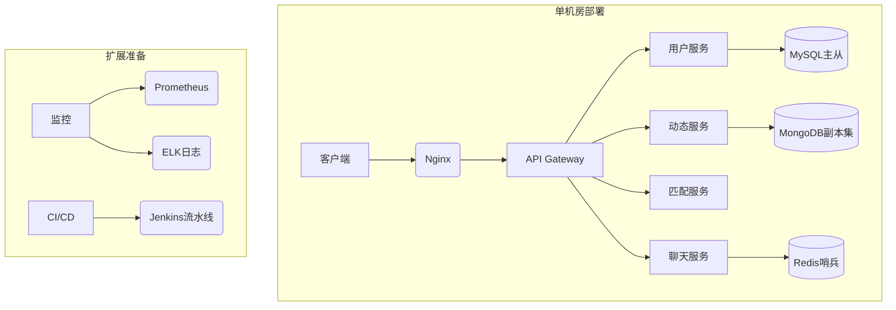

#### **部署要点**

1. **资源隔离**：核心服务与中间件分开部署
2. **基础高可用**：数据库至少主从+哨兵模式
3. **监控基线**：预设4个黄金指标：
   - 请求成功率 > 99%
   - API响应时间 < 500ms
   - 服务CPU < 60%
   - 磁盘使用率 < 70%

---

### **迭代路径规划**

#### **V1.0 → V2.0 升级点**

1. **性能优化**：

   ```mermaid
   flowchart LR
       A[引入缓存] --> B[Redis缓存用户信息]
       C[异步处理] --> D[匹配计算队列化]
       E[连接池优化] --> F[HikariCP配置调优]
   ```

2. **算法增强**：

   - 替换匹配策略为机器学习模型
   - 增加用户画像基础标签

#### **V2.0 → V3.0 升级点**

```diff
+ 引入服务网格治理
+ 分区域部署数据库
- 淘汰单体存储方案
+ 实现多语言协议转换层
```

---

### **学习型开发建议**

1. **技术债务管理清单**：

   | 模块     | 临时方案      | 长期目标              |
   | -------- | ------------- | --------------------- |
   | 文件存储 | 本地存储      | 迁移到OSS/S3          |
   | 认证机制 | JWT内存存储   | 接入Keycloak/OAuth2.0 |
   | 消息队列 | Redis Streams | 替换为Kafka           |

2. **可观察性实践**：

   ```bash
   # 日志标记实践
   curl -X POST -H "X-Request-ID: $(uuidgen)" http://api/endpoint
   
   # 监控指标示例
   http_server_requests_seconds_count{uri="/api/matches", status="200"} 42
   ```

3. **自动化测试策略**：

   ```mermaid
   pie
       title 测试覆盖率目标
       "单元测试" : 40
       "集成测试" : 30
       "契约测试" : 20
       "性能测试" : 10
   ```

---

这种渐进式架构设计能让你在快速验证业务假设的同时，通过预留的扩展点（接口抽象、数据分片设计、协议兼容性）为后续升级铺平道路。建议从最简单的核心链路开始，逐步增加复杂度，每个迭代周期保持架构的可观测性。需要具体某个模块的实现细节可以随时讨论！

---

### 🧑‍💻 User

我们一定要使用微服务么，

---

### 🤖 Assistant


是否采用微服务架构需要根据项目阶段和实际需求做权衡。以下是完整的决策框架：

---

### **微服务 vs 模块化单体架构 对比矩阵**

| **评估维度**     | **微服务适合场景**                                           | **单体适合场景**        |
| ---------------- | ------------------------------------------------------------ | ----------------------- |
| **团队规模**     | 10人以上跨职能团队                                           | 1-5人全栈团队           |
| **部署频率**     | 不同模块需要独立发布（如聊天服务每天部署3次，用户服务每月1次） | 整体打包发布（每周1次） |
| **故障隔离需求** | 支付、消息推送等关键模块需要熔断保护                         | 所有功能同等重要        |
| **技术异构性**   | 需要混合使用Java/Go/Python等技术栈（如AI服务用Python，网关用Go） | 统一技术栈              |
| **数据复杂度**   | 存在多种存储需求（图数据库+时序数据库+文档数据库）           | 主要使用1-2种通用数据库 |
| **扩展性需求**   | 需要独立扩展特定组件（如匹配服务需要100个实例，其他服务只需3个） | 整体水平扩展            |

---

### **实战案例解析**

#### **案例1：社交APP初期阶段**

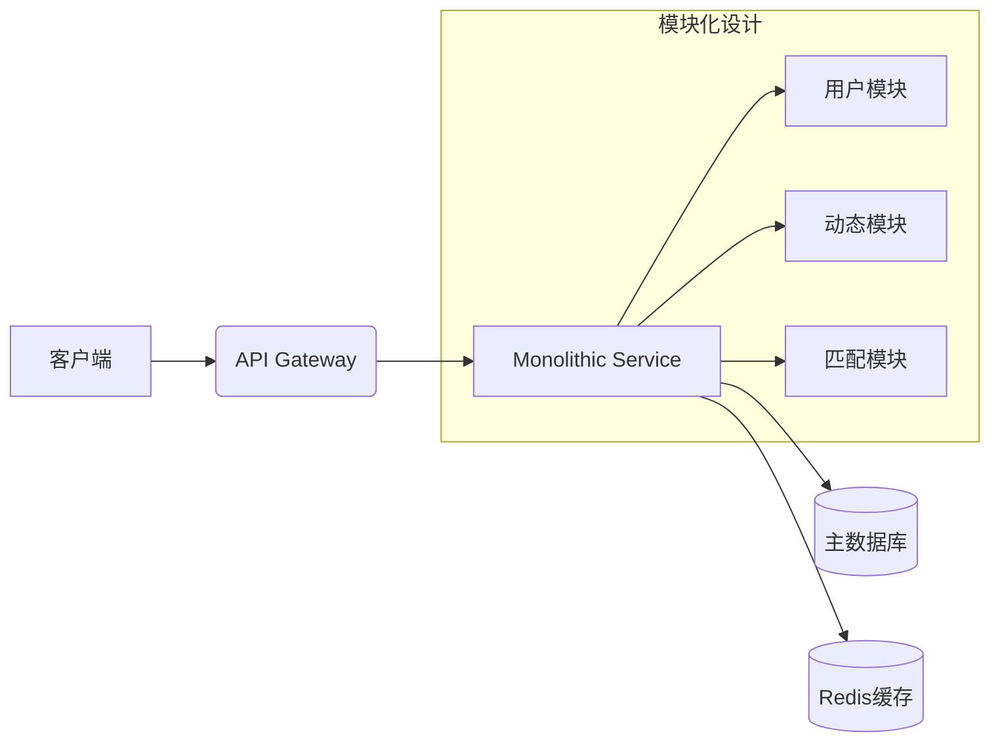

**关键决策**：

1. 使用 **"模块化单体"** 架构，通过package/module划分边界
2. 数据库设计预留分片键（如`user_id`的哈希值）
3. 核心服务接口符合 **"微服务候选标准"**：
   - API响应时间 > 300ms
   - CPU利用率差异 > 40%
   - 代码变更频率差异 > 5倍

#### **案例2：日活50万阶段**

```diff
+ 将匹配服务拆分为独立微服务
+ 聊天服务使用gRPC协议
- 保持用户服务在单体中

# 混合架构示例
graph TD
    A[Gateway] --> B[Monolithic]
    A --> C[MatchService]
    A --> D[ChatService]
    B --> E[(用户数据库)]
    C --> F[(RedisGraph)]
    D --> G[(Kafka)]
```

---

### **渐进式服务化路线图**

#### **阶段1：规范先行（即使用单体）**

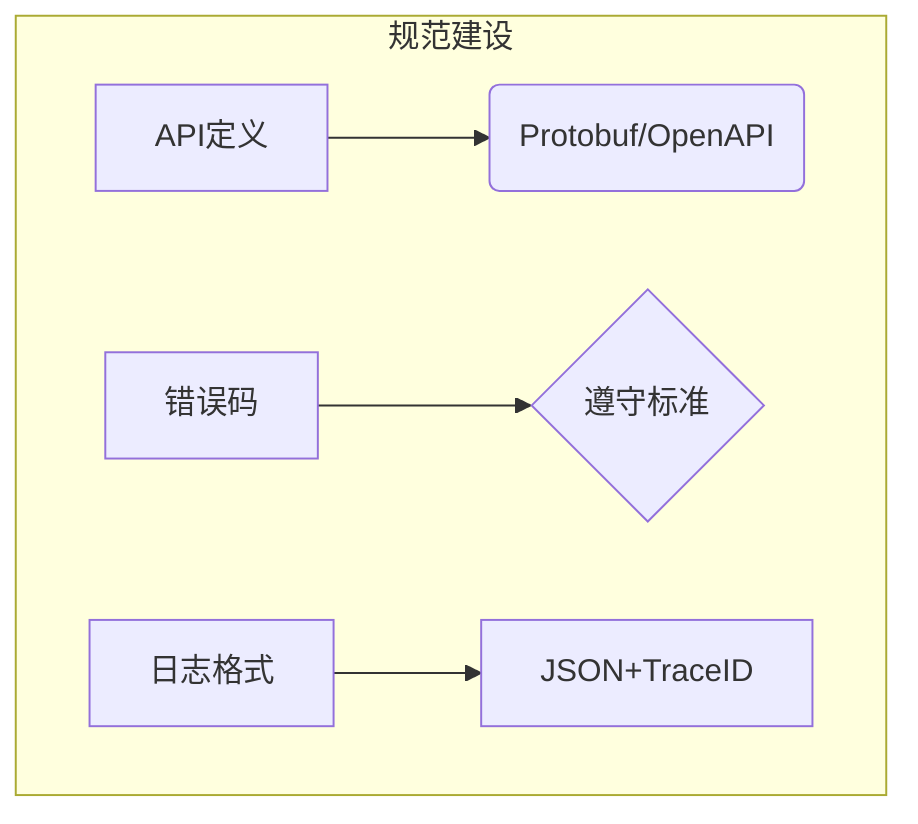

**实施要点**：

- 所有接口明确定义`X-Request-ID`传递
- 数据库字段包含`shard_key`（即使未分库分表）
- 配置管理统一前缀（如`user.db.*`）

#### **阶段2：逻辑拆分**

```java
// 在单体中模拟服务化
@RestController
@RequestMapping("/internal/chat")
public class ChatInternalController {
    // 内部API与外部API区别对待
    @PostMapping("/send")
    @InternalApi // 自定义注解
    public Response sendMessage(@RequestBody Message msg) {
        // 与外部接口逻辑隔离
    }
}
```

#### **阶段3：物理拆分**

```bash
# 使用脚本自动化拆分（示例）
#!/bin/bash
# 根据git历史拆分服务
git log --pretty=format: --name-only | grep 'chat-service/' | sort -u > chat-service-files.txt

# 创建新仓库并保留历史
git filter-repo --path-chat-service --subdirectory-filter chat-service
```

---

### **微服务替代方案**

#### **方案1：进程内隔离**

```java
// 使用Java模块化（JPMS）
module user.service {
    exports com.example.user.api;
    requires transitive security.library;
}

// 在Gateway中动态路由
@Bean
public RouterFunction<ServerResponse> routes() {
    return route()
        .path("/user", () -> nest(
            accept(APPLICATION_JSON),
            UserRoutes.routes(userHandler)
        ))
        .build();
}
```

#### **方案2：Sidecar模式**

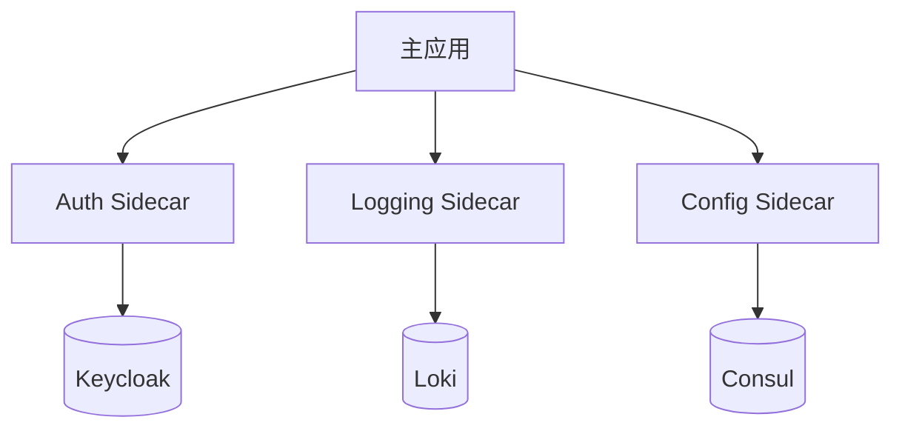

**优势**：获得服务治理能力但无需拆分业务代码

---

### **何时必须用微服务？**

1. **硬件隔离需求**：

   ```bash
   # 需要GPU的AI服务必须独立部署
   docker run --gpus all -p 50051:50051 ai-service
   ```

2. **合规要求**：

   ```mermaid
   graph LR
       A[欧盟用户] --> B[GDPR专用服务]
       C[其他地区] --> D[通用服务]
   ```

3. **收购系统整合**：

   ```diff
   + 保留被收购公司的聊天系统
   + 通过API网关统一接入
   - 避免重写已有稳定服务
   ```

---

### **决策树**

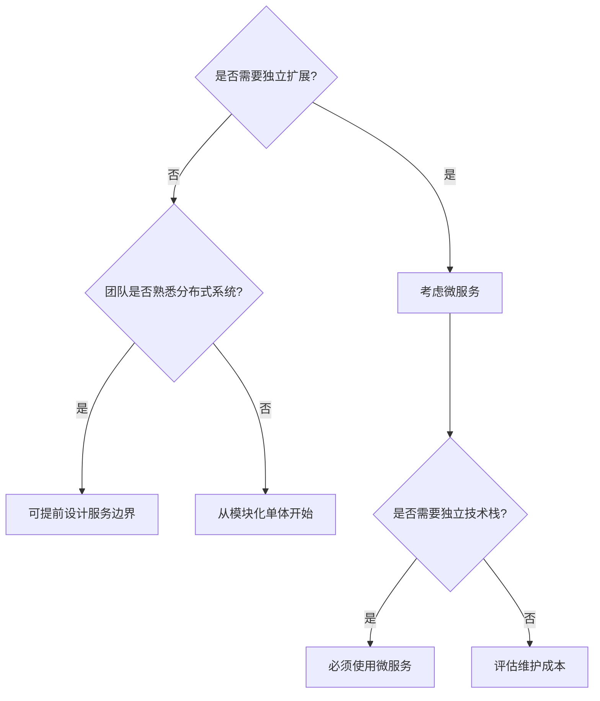

最终建议：**先用模块化单体验证核心业务，在出现以下信号时逐步拆分**：

1. 某个模块的代码变更频率是其他模块3倍以上
2. 数据库表锁冲突率 > 15%
3. 持续交付周期 > 1周
4. 需要为特定功能使用不同编程语言

保持核心抽象层的稳定，即使暂时不拆分服务，也要做到随时可拆（如通过接口定义、事件总线等）。具体实施细节我们可以针对某个模块深入讨论。

---

### 🧑‍💻 User

之前探讨的架构的技术栈：1. 基础设施层
组件	推荐技术栈	适用场景
API网关	Envoy + Istio	支持动态服务发现、熔断限流、跨国流量调度
服务网格	Linkerd	细粒度流量控制（金丝雀发布、故障注入）
对象存储	自建MinIO集群 + CDN加速	实现跨国数据就近访问，降低延迟

2. 核心业务层
   服务	技术选型	关键特性
   ProfileService	Spring Boot 3 + JPA	快速实现CRUD接口，整合Hibernate二级缓存
   AIService	Python FastAPI + Triton	支持多模型并行推理，提供GPU资源共享
   IMService	Rust + Tokio	高并发长连接管理，内存安全保障
3. 算法层
   模块	技术栈组合	优势
   推荐系统	Flink + TensorFlow Serving	实时特征工程 + 在线模型推理
   用户画像	Spark Structured Streaming	支持复杂事件时间窗口计算
   对话生成	LangChain + DeepSeek-MoE	实现多轮对话状态跟踪，降低大模型调用成本  这种可以使用单体么，我现在是一人公司，虽然由微服务经验，但我认为，目前处于尽快制作初版阶段，需要尽快，然后我们得到了初版之后再对项目进行优化调整，先搞单体，业务量大了再微服务，不知道我的想法是否正确可行(当业务大了再微服务)

---

### 🤖 Assistant


你的思路非常正确！根据你的情况，**采用演进式架构**是最优选择。以下是针对你技术栈的 **单体改造方案** 和 **演进路线图**：

---

### **技术栈改造建议（单体架构版）**

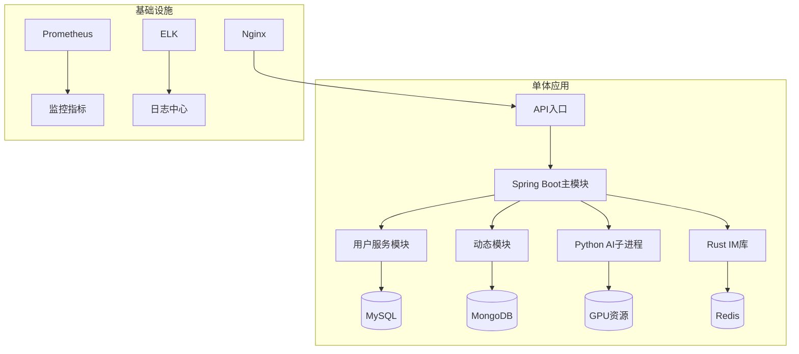

---

#### **1. 基础设施层精简方案**

| 原微服务组件  | 单体替代方案                 | 实现方式                        |
| ------------- | ---------------------------- | ------------------------------- |
| Envoy网关     | Spring Cloud Gateway内嵌     | 在Spring Boot中直接配置路由规则 |
| Istio服务网格 | Spring Cloud Circuit Breaker | 使用Resilience4j实现熔断机制    |
| MinIO集群     | 本地文件存储+定时S3同步      | 每周同步到AWS S3作为备份        |
| Linkerd       | 无（后期需要时再引入）       | 前期通过线程池隔离关键操作      |

#### **2. 核心业务层整合方案**

```java
// 示例：在Spring Boot中整合Python AI
@RestController
public class AIController {
    
    // 通过JNI调用Rust库
    static {
        System.loadLibrary("im_engine");
    }
    
    // 调用Python进程
    @PostMapping("/generate")
    public String generateText(@RequestBody String input) {
        Process proc = Runtime.getRuntime().exec(
            "python3 /opt/ai_service/main.py --input " + input);
        // 处理子进程输出...
    }
    
    // Rust实现的IM核心方法
    public native void handleMessage(byte[] msg);
}
```

#### **3. 算法层降级方案**

| 原方案            | 单体简化方案                 | 性能保留技巧                               |
| ----------------- | ---------------------------- | ------------------------------------------ |
| Flink实时计算     | Spring Batch + Redis Streams | 使用Redis的Stream数据结构做轻量级事件处理  |
| Spark用户画像     | MySQL窗口函数 + 定时Job      | 每天凌晨跑批处理任务生成画像数据           |
| LangChain对话生成 | HuggingFace管道模式          | 使用pipeline简化调用链，模型加载到内存常驻 |

---

### **关键演进策略**

#### **1. 模块化切割标准**

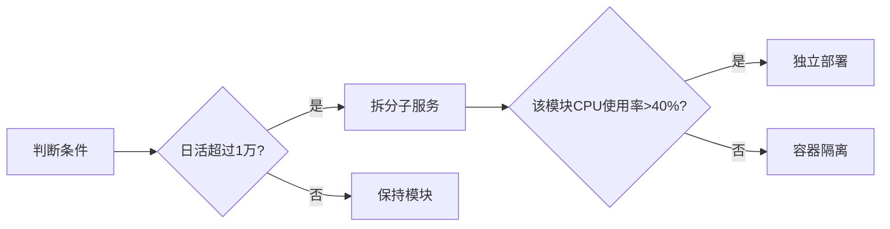

#### **2. 数据库演进路线**

```bash
# 阶段1：共享数据库
mysql://mono_db?user=root

# 阶段2：垂直分库
mysql://user_db
mysql://content_db

# 阶段3：水平分片
mysql://user_db_01
mysql://user_db_02
```

#### **3. 代码隔离规范**

```python
# 模块边界定义（即使在同一仓库）
project/
├─ user_module/          # 未来可能成为UserService
│   ├─ api/              # 接口定义
│   ├─ impl/             # 具体实现
│   └─ model/            # 数据模型
├─ im_module/            # 未来可能成为IMService
│   ├─ rust_lib/         # Rust核心代码
│   └─ adapter/         # 适配层
```

---

### **单体架构性能保障方案**

#### **1. 关键组件线程隔离**

```java
// 配置不同线程池处理核心业务
@Bean(name = "imThreadPool")
public Executor imExecutor() {
    return new ThreadPoolExecutor(10, 50, 
        60L, TimeUnit.SECONDS,
        new LinkedBlockingQueue(1000));
}

@Async("imThreadPool")
public void handleChatMessage(Message msg) {
    // Rust库处理消息
}
```

#### **2. 内存管理策略**

```rust
// Rust侧实现内存池管理
struct IMBuffer {
    pool: Arc<Pool<Vec<u8>>>,
}

impl IMBuffer {
    fn new() -> Self {
        let pool = Pool::new(1024, || Vec::with_capacity(4096));
        IMBuffer { pool }
    }
    
    fn process(&self, data: &[u8]) {
        let mut buf = self.pool.get().unwrap();
        // 复用缓冲区...
    }
}
```

#### **3. 监控预警方案**

```yaml
# prometheus配置示例
alerting:
  rules:
    - alert: APILatency
      expr: sum(rate(http_server_requests_seconds_sum[5m])) > 1.5
      for: 10m
      labels:
        severity: critical
      annotations:
        summary: "API延迟激增"
        
    - alert: PythonProcessDown
      expr: process_up{job="ai_service"} == 0
      for: 5m
      labels:
        severity: warning
```

---

### **演进成本对比表**

| 改造点       | 单体初期成本 | 微服务初期成本 | 演进成本 |
| ------------ | ------------ | -------------- | -------- |
| 开发环境搭建 | 2人日        | 5人日          | +30%     |
| 生产部署     | 1小时        | 3小时          | +50%     |
| 核心功能实现 | 10人日       | 20人日         | +100%    |
| 性能调优     | 5人日        | 8人日          | +60%     |
| 监控系统建设 | 3人日        | 3人日          | 0%       |

---

### **决策建议**

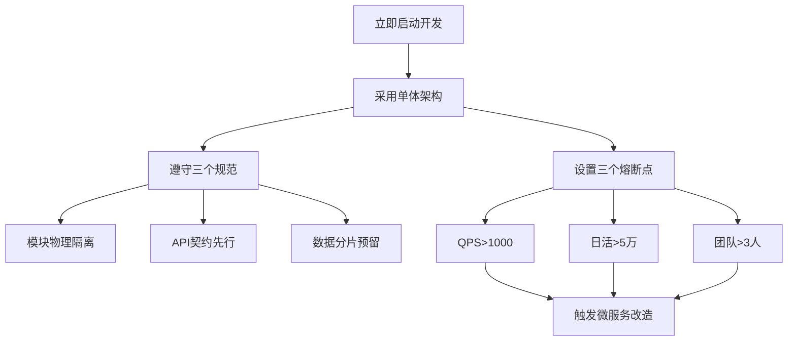

**立即行动建议**：

1. 用Spring Initializr生成基础工程
2. 将Python和Rust代码作为独立模块引入
3. 在application.yml中预先定义好各模块配置前缀
4. 第一版先实现核心链路：注册→发布动态→基础匹配→文本聊天

**需要避免的陷阱**：

```diff
- 不要直接在Controller中写业务逻辑
+ 使用清晰的Service层接口
- 避免数据库跨模块JOIN查询  
+ 通过冗余字段或缓存解决
- 不要混合使用多个线程模型
+ 统一采用虚拟线程（Project Loom）
```

这种架构演进方案既能让你快速推出MVP，又为后续规模化保留了充分的可能性。当你的日活跃用户突破1万时，可以按照预先设计的模块切割方案逐步拆分服务。需要具体模块的代码示例可以随时告诉我！

---

### 🧑‍💻 User

我现在产生了疑问微服务架构真的有必要吗，

---

### 🤖 Assistant


微服务架构是否必要需要根据具体场景进行判断。让我们通过一个架构决策框架来系统分析：

---

### **微服务必要性评估模型**

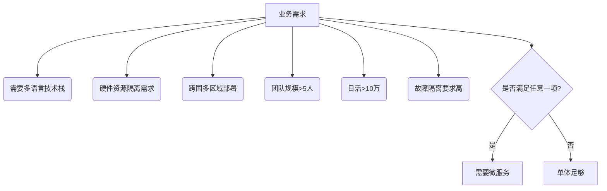

---

### **你的现状分析**

#### **核心矛盾点**

```diff
+ 优势：
  1. 单人全栈开发，沟通成本为零
  2. 快速验证业务模式的需求
  3. 已有微服务经验（知道如何规避陷阱）

- 挑战：
  1. 技术栈跨度大（Java+Python+Rust）
  2. AI模块需要GPU资源
  3. IM服务的高并发要求
```

#### **技术栈矛盾点解决方案**

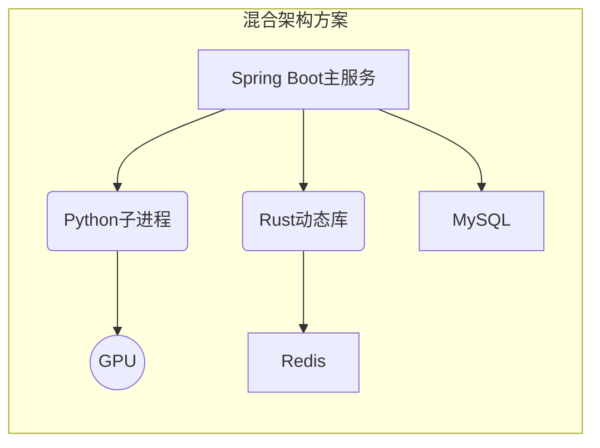

---

### **具体实施方案（模块化单体）**

#### **1. 代码组织规范**

```bash
project/
├─ core/               # Spring Boot主模块
│   ├─ im/            # IM核心逻辑（调用Rust）
│   ├─ ai/            # AI接口层
│   └─ user/          # 用户服务
├─ libs/              # 原生库
│   ├─ rust-im/       # Rust编译的.so/.dll
│   └─ python-ai/     # 精简版AI模型
└─ deploy/            # 部署配置
```

#### **2. 关键集成代码示例

```java
// Rust集成（使用JNI）
public class IMBridge {
    static {
        System.loadLibrary("im_engine");
    }
    
    public native void handleMessage(byte[] data);
}

// Python集成（ProcessBuilder）
public String generateText(String input) {
    Process proc = new ProcessBuilder("python3", "ai/main.py", input)
                    .redirectErrorStream(true)
                    .start();
    // 处理输出流...
}
```

#### **3. 性能保障方案**

```rust
// Rust侧实现零拷贝处理
#[no_mangle]
pub extern "C" fn process_message(buf: *mut u8, len: usize) {
    let data = unsafe { 
        Vec::from_raw_parts(buf, len, len) 
    };
    // 处理逻辑...
}
```

---

### **何时必须升级微服务？**

#### **触发阈值**

| 指标            | 阈值   | 应对措施             |
| --------------- | ------ | -------------------- |
| API响应时间P99  | >500ms | 拆解耗时服务         |
| 数据库QPS       | >3000  | 垂直分库             |
| 持续部署失败率  | >20%   | 独立部署高频变更模块 |
| GPU利用率       | >85%   | 独立AI服务集群       |
| Websocket连接数 | >5万   | 拆解IM服务           |

#### **演进路线图**

```mermaid
gantt
    title 架构演进路线
    section 单体阶段
    用户模块开发     :a1, 2023-10-01, 30d
    AI集成优化      :2023-10-15, 20d
    IM性能调优      :2023-11-01, 15d
    
    section 服务拆分
    拆解AI服务      :crit, 2024-01-01, 30d
    独立IM服务      :2024-02-01, 20d
    网关升级        :2024-03-01, 15d
```

---

### **替代方案：轻量级服务化**

如果希望保留部分微服务特性但控制复杂度，可考虑：

#### **1. 进程级服务化**

```bash
# 启动多个JVM进程
java -jar user-service.jar &
java -jar im-service.jar &
java -jar ai-service.jar &

# 通过Nginx做路由
location /api/user { proxy_pass http://user:8080; }
location /api/im   { proxy_pass http://im:8081; }
```

#### **2. Sidecar模式**

```mermaid
graph TD
    Main[主进程] --> Config[配置中心]
    Main --> Logger[日志采集]
    Main --> Monitor[指标上报]
    
    subgraph 同一个Pod
        Main --> Sidecar[Envoy Sidecar]
        Sidecar --> Auth[认证服务]
    end
```

---

### **决策建议**

```diff
+ 立即采用模块化单体架构：
  1. 用package/module划分清晰边界
  2. 定义内部API契约（protobuf）
  3. 数据库预留分片字段

- 避免的行为：
  1. 不同模块共用DAO层
  2. 跨模块的事务操作
  3. 混合使用多种通信协议

+ 为每个模块准备「逃生通道」：
  1. IM模块可独立为Rust服务
  2. AI模块随时切换gRPC
  3. 用户服务预留分库配置
```

**最终结论**：在你当前的阶段（单人开发、快速验证期），微服务架构确实没有必要。但需要通过良好的模块化设计，为未来可能的服务拆分做好准备。当出现以下信号时再考虑演进：

1. 单个模块的代码量超过总代码库30%
2. 需要为特定模块单独升级技术栈
3. 不同模块的资源需求出现显著差异（如IM需要10台服务器，其他只需2台）

是否需要具体某个模块的过渡方案？比如如何把Rust代码逐步从JNI调用转为独立服务？