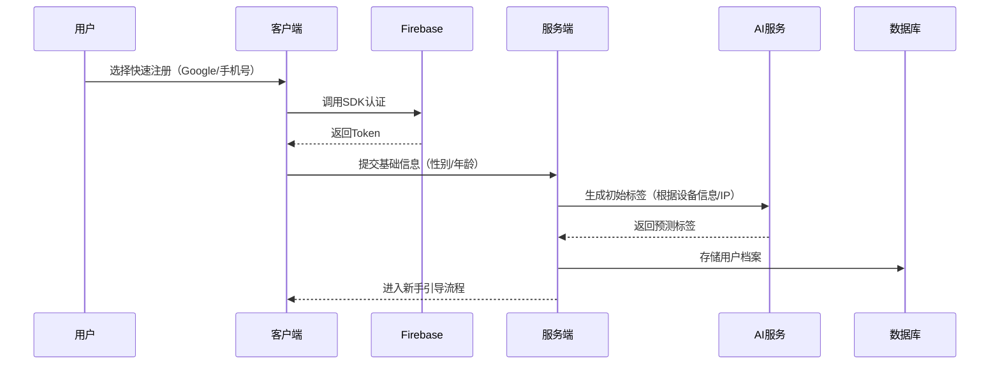
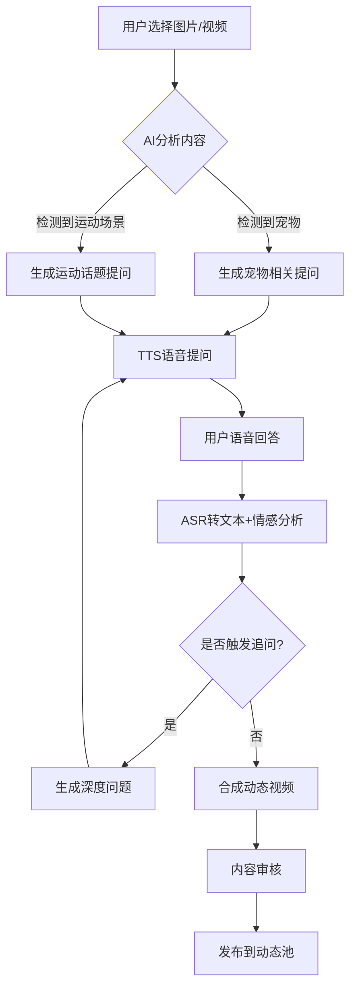
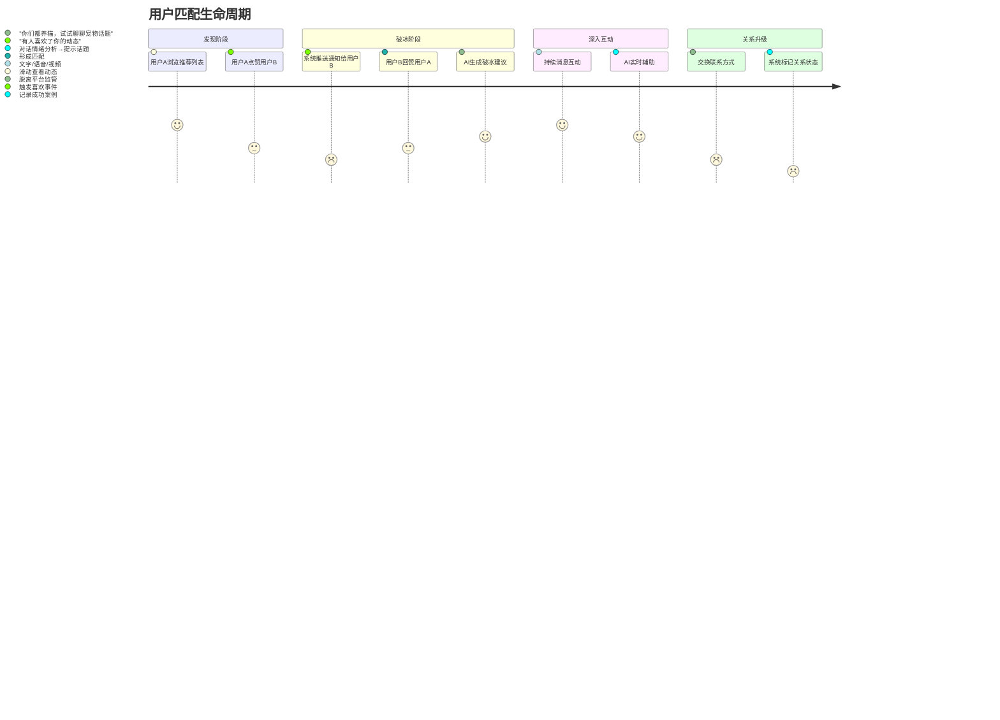

### **业务梳理与核心流程分解**

---

#### **一、业务全景图**
**核心目标**：通过AI增强的互动体验，帮助用户快速建立信任关系，实现精准匹配。  
**业务分层**：  
```
  ┌──────────────┐       ┌──────────────┐  
  │  用户交互层   │◄─────►│   业务逻辑层   │  
  │ (客户端/前端)  │       │ (服务端/后端)  │  
  └──────────────┘       └───────┬──────┘  
                                 ▼  
                         ┌──────────────┐  
                         │  数据与算法层  │  
                         │ (存储/计算/AI) │  
                         └──────────────┘  
```

---

#### **二、核心业务模块分解**
##### **1. 用户管理**
- **功能范畴**：  
  - 注册/登录（第三方集成）  
  - 基础信息管理（年龄、性别、地理位置）  
  - 用户标签体系（兴趣、生活方式、价值观）  
  - 账号安全（设备绑定、敏感操作验证）  

- **数据流向**：  
  ```
  客户端 → 网关 → 用户服务 → MySQL  
                              │  
                              ▼  
                       用户画像系统 → ES
  ```

##### **2. Moment动态**
- **核心价值**：  
  通过AI引导用户生成高质量UGC内容，增强用户吸引力与匹配准确性。

- **关键流程**：  
  ```
  1. 用户上传素材（图片/视频）  
  2. AI分析素材内容（VQA视觉问答）  
  3. 生成引导性问题 → TTS语音提问  
  4. 用户语音回答 → ASR转文本  
  5. 合成动态内容（视频+对话字幕）  
  6. 内容审核 → 发布 → 进入推荐池
  ```

- **技术依赖**：  
  - **AI交互**：LLM生成问题 + VQA模型分析  
  - **多媒体处理**：FFmpeg视频合成 + 云转码  
  - **安全审核**：图片鉴黄 + 文本敏感词过滤  

##### **3. 推荐系统**
- **匹配逻辑**：  
  ```
  Match Score = 基础属性权重 × (地理位置距离 + 标签相似度) + AI增强因子  
  ```
  - **基础属性**：年龄、性别、语言  
  - **AI增强因子**：动态内容情感分析 + 对话互动深度  

- **推荐策略演进**：  
  ```
  初版：规则引擎（IFTTT） → V2：协同过滤 → V3：GNN图谱推荐
  ```

##### **4. IM对话**
- **交互模式**：  
  ```
  ┌───────────┐        ┌───────────┐  
  │ 真实用户A  │ ←───→ │ 真实用户B  │  
  └───────────┘        └───────────┘  
         │                    │  
         └─────→ AI红娘 ←─────┘  
          （破冰建议/话题提醒）
  ```

- **核心状态机**：  
  ```mermaid
  stateDiagram
    [*] --> 未匹配
    未匹配 --> 已匹配: 双方点赞动态
    已匹配 --> 对话中: 发送消息
    对话中 --> 已拉黑: 用户投诉
    已匹配 --> 未匹配: 24小时无互动
  ```

---

#### **三、关键业务流程**
##### **1. 用户冷启动流程**


##### **2. Moment发布流程**


##### **3. 双人匹配流程**


---

#### **四、业务扩展点规划**
##### **1. 核心功能（MVP必需）**
| 模块         | 必须功能                             | 可延期功能                     |
|--------------|--------------------------------------|--------------------------------|
| 用户管理     | 第三方登录+基础信息录入              | 人脸实名认证                   |
| Moment动态   | 图文动态发布+AI基础问答              | 视频实时美颜/AR滤镜            |
| 推荐系统     | 基于距离/标签的规则推荐              | 实时在线模型推理               |
| IM对话       | 文字聊天+未读提醒                    | 语音消息/视频通话              |

##### **2. 创新功能池（差异化竞争力）**
- **AI红娘进阶**：  
  - 对话复盘报告（分析沟通模式）  
  - 虚拟约会模拟（AI生成互动场景）  
- **社交游戏化**：  
  - 双人任务挑战（如"一起听歌猜歌名"）  
  - 成就徽章体系  
- **安全增强**：  
  - 区块链存证（防聊天记录篡改）  
  - 亲密关系健康度评估  

---

#### **五、业务优先级矩阵**
```  
                 ┌───────┬───────┬───────┐  
                 │  高   │  中   │  低   │  
┌──────────────┼───────┼───────┼───────┤  
│ 用户留存相关  │ 匹配效率 │ AI破冰 │ 成就系统│  
├──────────────┼───────┼───────┼───────┤  
│ 获客增长相关  │ 邀请裂变 │ 社交分享│ 广告系统│  
├──────────────┼───────┼───────┼───────┤  
│ 风险控制相关  │ 内容审核 │ 举报处理│ 区块链  │  
└──────────────┴───────┴───────┴───────┘  
```

---

#### **六、业务验证指标**
##### **1. 北极星指标**
```
核心公式：  
  匹配成功率 = 有效互关对数 / 总曝光用户对  
  有效对话率 = 对话超过10轮的用户对 / 总匹配对数  
```

##### **2. 关键监测看板**
| 指标类型       | 具体指标                          | 预警阈值          |  
|----------------|-----------------------------------|-------------------|  
| 用户体验       | 动态发布平均耗时                  | >8秒触发优化      |  
| 算法效果       | 推荐点击率（CTR）                | <3%触发策略调整   |  
| 商业价值       | 付费会员转化率                   | 周增长<2%告警     |  
| 系统健康度     | IM消息送达延迟（P99）            | >500ms排查        |  

---

#### **七、总结：业务演进路线**
```
  Phase 1：核心链路闭环（2个月）  
    重点：注册→动态→匹配→聊天  
    目标：验证用户愿为AI互动买单  

  Phase 2：留存优化（3-6个月）  
    重点：推荐算法迭代 + 社交游戏化  
    目标：DAU/MAU > 30%  

  Phase 3：商业变现（6-12个月）  
    重点：虚拟礼物 + 红娘增值服务  
    目标：ARPU > $5/月  
```

通过以上梳理，可将复杂业务拆解为可执行的模块化任务，在保证快速迭代的同时，为后续架构扩展预留空间。
#### 具体实现
1. 基础设施层
组件	推荐技术栈	适用场景
API网关	Envoy + Istio	支持动态服务发现、熔断限流、跨国流量调度
服务网格	Linkerd	细粒度流量控制（金丝雀发布、故障注入）
对象存储	自建MinIO集群 + CDN加速	实现跨国数据就近访问，降低延迟

2. 核心业务层
   服务	技术选型	关键特性
   ProfileService	Spring Boot 3 + JPA	快速实现CRUD接口，整合Hibernate二级缓存
   AIService	Python FastAPI + Triton	支持多模型并行推理，提供GPU资源共享
   IMService	Rust + Tokio	高并发长连接管理，内存安全保障
3. 算法层
   模块	技术栈组合	优势
   推荐系统	Flink + TensorFlow Serving	实时特征工程 + 在线模型推理
   用户画像	Spark Structured Streaming	支持复杂事件时间窗口计算
   对话生成	LangChain + DeepSeek-MoE	实现多轮对话状态跟踪，降低大模型调用成本